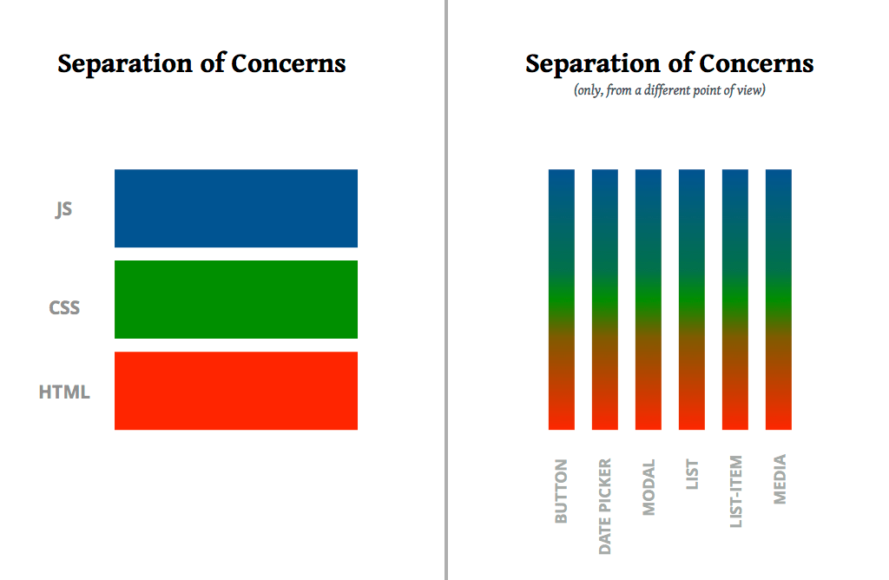
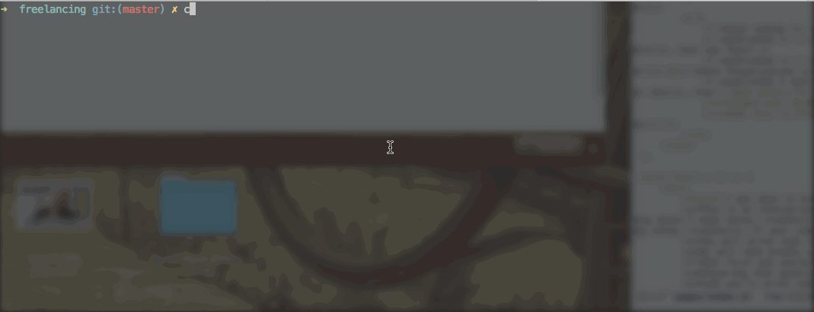
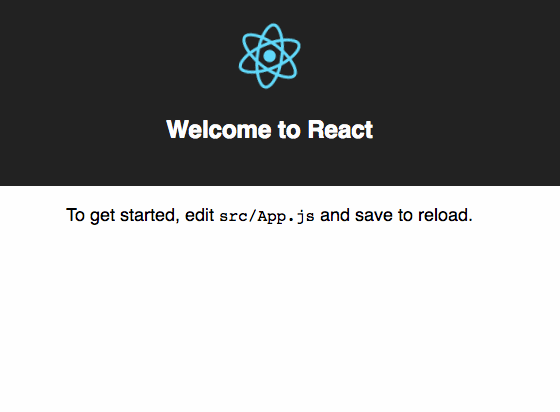
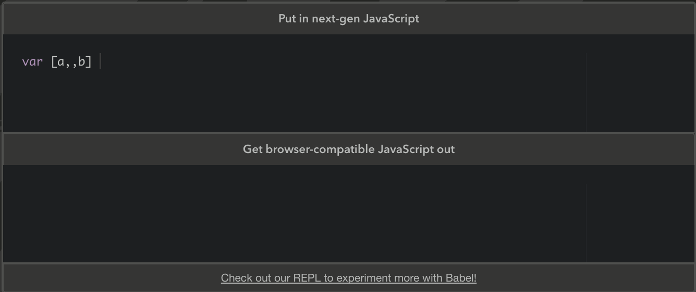
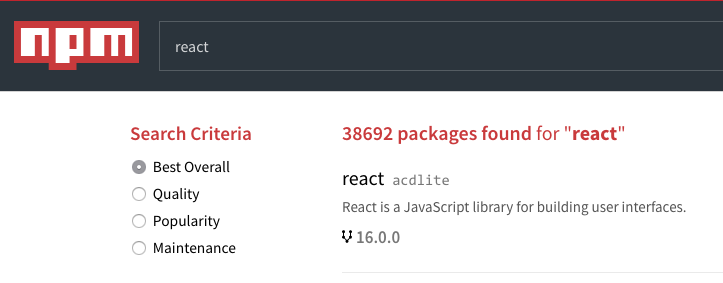

# React's biggest innovation

I like to say React is the biggest revolution in writing code for browsers since jQuery. You probably don't remember what life was like before jQuery. It was bad.

Before jQuery we spent a lot of time worrying about the DOM and how to talk to it. Each browser was different and you had to take that into account.

jQuery solved that.

Then webapps became bigger and more complex. jQuery code started to look like spaghetti. You couldn't tell the difference between code that's worrying about *how* to render something and code that's deciding *what* to render.

Backbone helped but it was cumbersome and awkward. Been using it professionally since before version 1 ... 0.6, I think. If you're still using Backbone and you're struggling, I share your pain. My day job is 80% Backbone.

Angular wasn't much better. 

## Enter React, stage left

And then there was React. In my opinion the best thing that's happened to the web in the past 10 years.

React's big innovation is that it solves our most painful problem 👇

> How to achieve good rendering performance without ever thinking about how things are rendered

Unlike jQuery or Backbone or even Angular, React uses something called the virtual DOM. An in-memory presentation of your document that it can play with *before* rendering the page. 


As a result, React triggers repaints and reflows only when it needs to. Your changes are batched and committed to the page when necessary.

And because React uses an advanced tree diffing algorithm, it can avoid re-rendering elements that didn't change. The fewer repaints, the faster the webapp.

A lot of heavy research has gone into tree diffing algorithms over the years (decades). You don't want to reinvent all of that every time your Backbone View has a child View. 😉

# Components are the future

Now I don't know what React is going to look like 10 years from now, or if we're still going to use React, but I can tell you one thing

> The component is here to stay

Think about how you build user interfaces. You're probably concerned about separation of concerns, right?

And just like I used to, you like to think of separation of concerns in terms of technology:

- JS for behavior
- CSS for styling 
- HTML for structure

You dream of the day when a designer will write your HTML and your CSS so you can focus on the *real* code – JavaScript.

Yet the day never comes. You keep writing all of it, they keep being tightly coupled, and you're just annoyed that you have to build your stuff in a bazillion different files.

It turns out "separation of concerns" in UI is more about separation of usecase than technology.

[](http://www.didoo.net/2017/10/let-there-be-peace-on-css/)

A button is always a button, a date picker is a date picker. Your UI is a series of components most of which you can develop separately and reuse over and over again.

# A gentle introduction to JSX

Where React truly shines is that it makes components practical.

With JSX – JavaScript eXtension – HTML becomes a first-class citizen in your code. You can, for example, assign a chunk of HTML to a variable.

```jsx
const chunk = <div>
	<h1>Hello world</h1>
	<p>I'm a paragraph</p>
</div>
```

Behind the scenes JSX compiles into a series of `createElement` function calls. Our `chunk` turns into something like this:

```jsx
const chunk = createElement('div', [
	createElement('h1', "Hello world"),
	createElement('p', "I'm a paragraph")
]);
```

I find JSX a lot easier to read. You can look at my code and see that it's a div with a title and a paragraph.

> If you can read HTML, you can read JSX.

Here's where it gets interesting. Now that we have a `chunk` of HTML, we can use it in other HTML.

```jsx
<div>
	{chunk}
	<p>I am another paragraph</p>
</div>
```

With JSX, you can put any JavaScript expression in `{}`. It evaluates and puts the result in your HTML.

You can even do it in props!

```jsx
// this works too
<div>
	<h1 id={getSlug()}>{getTitle()}</h1>
	{getContent()}
</div>
```

And you can define custom elements.

```jsx
const Article = () => (
	<div>
		<h1 id={getSlug()}>{getTitle()}</h1>
		{getContent()}
	</div>
);
```

That's actually a React functional stateless component. You can use it like any other HTML element. Don't worry about the details right now, we'll talk more about components in the next section.

Here's how you render a component:

```jsx
<div>
	<Article />
	<Article />
</div>
```

HTML elements are lower case, React components must start with a capital. That's how you tell them apart.

As you'll see in future sections, bringing HTML into JavaScript is powerful. You get all the benefits and power of JavaScript combined with the declarative nature and readability of HTML. 👌

# Modern build tools

JSX, however, is not a part of JavaScript 👉 we have to use a compiler to make it work.

JavaScript used to be something you write in a simple text editor, open in your browser, and see what happens. Nowadays it's becoming more and more a compiled language.

Your code often runs through multiple compilers before it reaches the user. Everything from transforming ES5 into ES6 and beyond, to minifying your code and splitting it into bundles.

## Start with create-react-app

To avoid the pain of setting all that stuff up from scratch, we're using a toolkit: [`create-react-app`](https://github.com/facebookincubator/create-react-app). It's the officially recommended way to bootstrap a new React application.

Workshop code from this point onward assumes you're running inside a `create-react-app` project.

In your terminal, run:

```
$ create-react-app intro-to-react-workshop-project
$ cd intro-to-react-workshop-project
```



This creates a new directory with your app, uses `npm` or `yarn` to install dependencies, and comes with a great default config.

Our code goes in `src/`, which right now contains a basic App, some CSS, an SVG image, and a test file. The environment is fully set up for you to write modern JavaScript code without worrying that this or that feature is unsupported.

Run the development server.

```
$ npm/yarn start
```



The two most important tools `create-react-app` set up for us are [Webpack](https://webpack.js.org/) and [Babel](https://babeljs.io/). Webpack is our bundler and Babel is our JavaScript transpiler. Let me explain.

## Webpack


Webpack calls itself a module bundler. Its core task is to give us JavaScript modules.

You write code in many different files, use `import` and `export` statements, and it all gets bundled up in one huge file for the browser to run. We've had this before Webpack with Browserify and tools like that.

What we didn't have before Webpack is the ability to import *anything*. You can use Webpack to import CSS, images, video, any sort of file that you'd want to serve to your user.

This happens through loaders, which are a lot like plugins. They're called loaders because they load things. 🤷‍♀️

For example, when you import an image file, it turns into a URL string that you can use.

```javascript
import Morty from 'images/morty.png';

console.log(Morty); // /static/media/1.40869a28.mp4
```

Fingerprinted for cache busting, moved into a `static/media` structure ... everything you need. 👌

CSS turns into `<style></style>` tags, you can set up code splitting to avoid loading code your users don't need, throw away unused code and a bunch of other fun tweaks. I've been able to use Webpack configuration to send up to 50% less code to our users, for example.

Webpack is great. ❤️

## Babel



Babel is a transpiler. It takes your modern JavaScript and returns old school JavaScript that works on all browsers.

Like Webpack, it also comes in the shape of piles upon piles of plugins. Unlike Webpack, I find that it requires a lot less configuration and thinking about.

Personally I like to rely on a couple of preset plugins and leave it at that. In theory you can start removing Babel plugins as browsers improve and you can ship more and more modern code.

The fewer transforms you use, the smaller your code can become, but the newer the browser it requires. You are not likely to go without Babel any time soon.

# React ecosystem

My favorite part about React is its vast ecosystem. I'm hoping for a future where *"There's an open source component for that"* becomes the answer to almost everything.

You know, like we used to have with jQuery, but better.

Right now you can already find a lot of pre-configured, pre-styled, widget components for almost anything you can think of. 

NPM currently lists 38,692 packages containing the word `react`.



## Some common dependencies

React on its own gives you just the view layer. The part that creates visual components and renders them to the browser.

You can use it with any framework, even Angular or Backbone, or you can build your own out of tools available in the ecosystem. That's what most people do.

Some common pieces that people use are 👇

1. A state management library (usually Redux or MobX)
2. A routing solution 

## Debugging/Testing
