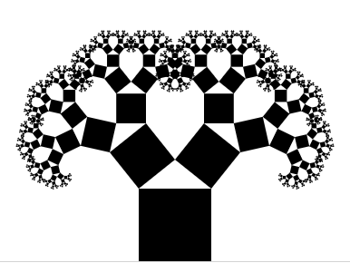

To learn about React components, we're going to build a fractal tree. One component repeated 2048 times.


I'll build it with you from scratch. You can see a [working version on Github](https://swizec.github.io/react-fractals/)

# Two flavors of components

React components come in two flavors:

- class components
- functional stateless

A title component might look like this 👇

```jsx
class Title extends Component {
	render() {
		return <h1>{this.props.title}</h1>
	}
}

ReactDOM.render(<Title title="Hello world" />, document.getElementById('root'))
```

Class components get all of React's features:

- they have props
- there's state
- lifecycle hooks work

But writing all of that gets tedious, if all you want is to render a few elements. So you can use functional stateless components instead 👇

```jsx
const Title = ({ title }) => <h1>{title}</h1>;

ReactDOM.render(<Title title="Hello world" />, document.getElementById('root'))
```

Same result, a lot less typing.

Stateless components keep props, but lose state and lifecycle hooks. In return they have smaller overhead and are quicker to write.

## Component children

Using our `Title` component is kind of tedious. We can make it better with React's magic `children` prop.

```jsx
const Title = ({ children }) => <h1>{children}</h1>;

ReactDOM.render(<Title>Hello world</Title>, document.getElementById('root'))
```

We're still saying `Title` twice, but this way feels more natural. 

Component children are passed into every component as props. You can do with them as you please.

Components behave just like custom HTML elements. You can nest them, you can pass them around, you can do whatever you want.

## Practical exercise

Go into the project you created with `create-react-app` in the last section and move header stuff into a new component. Replace the body with a new `<DancingTree>` component that renders a 1028x600 `<svg>`.

# State, Props, and Unidirectional data flow

When you're building apps with React, you want to make sure information always flows in one direction. You should always have a single source of truth, which sends information down to components via props, and accepts updates through callbacks or global actions.

More on that later.

For now just keep in mind that your component should always be able to render itself from props. Avoid relying on state whenever possible.


When you *do* need state, you should drive it through React's built-in state management (or Redux/MobX, but that's next week).

> You can think of state as props that change over time. 

You drive the change through calling `this.setState` on your class-based component.

Like this 👇

```jsx
this.setState({
	heightFactor: .8,
	lean: .2
})
```

Calling `setState` updates the component's `this.state` object and triggers a re-render. Yes, you re-render on every state change. That's the beauty of React.

## Practical exercise – props

Let's build  a `Pythagoras` component that renders an SVG rectangle. That's a `<rect>`, by the way. 

Your `Pythagoras` component should accept a `width`, a `height`, and an `x`, `y` position and render an appropriate rectangle.

...

Did you get it? Now let's make it recursive.

Change your `Pythagoras` component so it renders both a rectangle and two more Pythagoras components. One to the `left` and one to the `right`. Make sure you add a `maxlvl` prop and keep track so you don't render infinitely many rectangles.

Don't forget to make child rectangles smaller :)

I suggest copying this trig calculation

```jsx
const memoizedCalc = function () {
    const memo = {};

    const key = ({ w, heightFactor, lean }) => [w,heightFactor, lean].join('-');

    return (args) => {
        const memoKey = key(args);

        if (memo[memoKey]) {
            return memo[memoKey];
        }else{
            const { w, heightFactor, lean } = args;

            const trigH = heightFactor*w;

            const result = {
                nextRight: Math.sqrt(trigH**2 + (w * (.5+lean))**2),
                nextLeft: Math.sqrt(trigH**2 + (w * (.5-lean))**2),
                A: Math.deg(Math.atan(trigH / ((.5-lean) * w))),
                B: Math.deg(Math.atan(trigH / ((.5+lean) * w)))
            };

            memo[memoKey] = result;
            return result;
        }
    }
}();
```

And applying it to your component like this

```jsx
const Pythagoras ...
		const { nextRight, nextLeft, A, B } = memoizedCalc({
        w: w,
        heightFactor: .4,
        lean: 0
    });
    
    if (left) {
        rotate = `rotate(${-A} 0 ${w})`;
    }else if (right) {
        rotate = `rotate(${B} ${w} ${w})`;
    }

    return (
        <g transform={`translate(${x} ${y}) ${rotate}`}>
```

`<g>` is a grouping element in SVG, but that's not the point of this exercise. Think of it as a `<div>` in HTML.

## Practical exercise – state

You should see a fractal tree of about 2048 black nodes.



Now try changing your tree so it reads `heightFactor` and `lean` from state. Where do you think they should live?

Remember, you want a single source of truth.

To make it extra fun, tie that state to mouse movement. That way you can make the tree dance with your mouse.

Since mouse events are tricky on SVG, I suggest using D3. It performs some transformations for you so you don't have to think about what's going on.

I suggest something like this:

```jsx
import { select as d3select, mouse as d3mouse } from 'd3-selection';

// ...
d3select(this.refs.svg).on("mousemove", this.onMouseMove.bind(this));

// ...
onMouseMove(event) {
    if (this.running) return;
    this.running = true;

    const [x, y] = d3mouse(this.refs.svg),
}
```

Hint: use `componentDidMount` to attach that mouse listener. I'll explain what it is next.

# Lifecycle hooks

One of my favorite features of React's class-based components are their lifecycle hooks. You can think of them as callbacks for key events in a components lifecycle.

Is that a bad pun? 😇

## Creating a component

* constructor()
* componentWillMount()
* render()
* componentDidMount()

## Updating a component

* componentWillReceiveProps()
* shouldComponentUpdate()
* componentWillUpdate()
* render()
* componentDidUpdate()

## Removing a component

* componentWillUnmount()

The best way to explain these is through a diagram and lots of hand waving.

If you get video of my explanation, we can try to insert it here for posterity. Make a PR!

# Component styling

It's time to make our dancing tree beautiful. We have a couple of options 👇

1. **CSS**, React components are just HTML, you can use CSS the same way you always have
2. **style prop**, great for one-off style definitions
2. **CSS modules**, use CSS files, apply classes with the `styleName` prop
3. **styled components**, create styled versions of common components

Let's try all four and see which one you like best.

## CSS

```css
rect {
	fill: lightblue;
}
```

## style prop

```css
import { interpolateViridis } from 'd3-scale';
<rect style={{fill: interpolateViridis(lvl/maxlvl)}} />
```

👆 great for giving each rectangle a different color

## CSS modules

```css
.rect {
	fill: #ffb6c1 
}
```

```jsx
import CSSModules from 'react-css-modules';
import styles from './index.css';

<rect styleName="rect"
```

## Styled components

```jsx
import styled from 'styled-components';
const Rect = styled.rect`
	fill: lightseagreen;
`

<Rect ... />
```

As far as I can tell there is no consensus about which is best. They all come with a different set of tradeoffs.