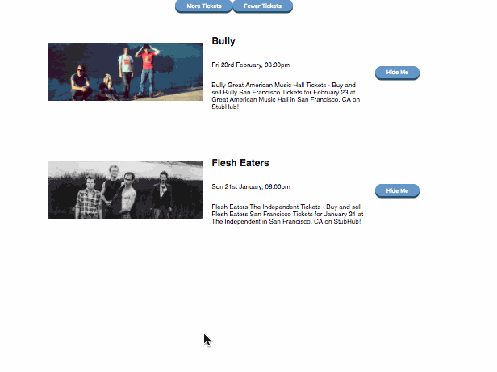

Now we're building an app. A simple app without *proper* state management, but an app non-the-less.

We're going to expand our list of tickets with some more controls. Growing and shortening the visible list, filtering out tickets we don't like, that sort of thing.



# What goes in which component

So, how do you decide what should be a component and what shouldn't? When do you break a file into two? How do you structure your code?

The answers are subjective and often boil down to *"It felt right"*. I can explain this better by drawing pictures and waving my arms.

Ultimately it boils down to this 👇

> If you have to use "and" to describe what your component is for, you should split it up

## Practical exercise

Let's add a list component that renders multiple tickets. 

## Unidirectional flow – props 👇 events 👆

Remember that picture from the last section?


That's actually a Vue picture. The unidirectional data flow that React popularized was such a great idea that everyone wants to use it now.

At its core the idea is that you can always know what's going on with your app. You have one source of state, you have a set of actions that change it, and your UI reacts to those changes.

I like to think of it as a state machine.

`[whiteboard explanation]`

### Practical exercise

Add ability to remove tickets from list.

## Generalized components

HOCs – higher order components – and Render callbacks.

Here is an example of a HOC

[CodePen link](https://codepen.io/swizec/pen/woNjVw)

This particular HOC wraps non-React code in a React component. You can use this approach for all sorts of things where you need to embrace and extend a component.

Although I find that plain old `extend` works just as well in many cases. 

Another approach to building generalized components is the render callback pattern. Famously used by Kent C. Dodds' [downshift](https://codepen.io/swizec/pen/woNjVw) library.

The idea there is to have a component that deals with logic and instrumentation, but defers rendering to others. Some prefer explicitly calling functions, others just render the children prop.

A similar approach is using render props where you put that callback in a prop.

# Routing

We're going to use Routing more practically tomorrow. Here's a quick explanation.

React Router is designed to be declarative and follow normal React patterns. You declare your routes like this 👇

```jsx
const routes = (
	<Route path="/" component={App}>
		<IndexRoute component={Home} />
		<Route path="/stuff" component={stuff} />
	</Route>
);

<Router routes={routes} history={browserHistory} />
```

Your URL structure then follows the structure of these routes. ReactRouter swaps around what it's rendering based on the route.

And you use `<Link>` to link between pages.

This workshop page is built using [GatsbyJS](https://www.gatsbyjs.org/) and uses ReactRouter behind the scenes.

# Interop with Backbone, jQuery, and Friends

React becomes truly spectacular once you realize that a React component is just a function that returns some HTML. That realization opens you up to fun things.

You can [wrap React components in jQuery plugins](https://swizec.com/blog/using-react-in-the-real-world/swizec/6710). Albeit the example is old and needs updating to modern React, but the gist of it still works.

And you can [interop with Backbone](https://github.com/Swizec/react-backbone-proof-of-concept) really well. At the day job I even built a HOC for it, but I never got around to opensourcing.

Looks like this 👇

```jsx
export function backbone(BackboneView) {
    return function(WrappedComponent) {
        return class Backbone extends WrappedComponent {
            constructor(props) {
                super(props);

                this.killAutorun = autorun(this._render.bind(this));
            }

            componentDidUpdate() { this._render() }
            componentDidMount() {
                this._render();
                if (super.componentDidMount) {
                    super.componentDidMount();
                }
            }
            componentWillUnmount() {
                this._cleanup();
                this.killAutorun();
            }

            _init() {
                this.backbone = new BackboneView(Object.assign({},
                                                               this.props,
                                                               this.backboneProps));
            }

            _render() {
                this._cleanup();
                if (_.isUndefined(this.renderIf) || this.renderIf) {
                    this._init();
                    this.backbone.setElement(this.refs.anchor).render();
                }
            }

            _cleanup() {
                if (this.backbone) {
                    this.backbone.undelegateEvents();
                }
            }

            get anchor() {
                return (<div ref="anchor" />)
            }
        }
    }
}
```

Generally speaking, you can either use React as the renderer and wrap it in other stuff. Or you can use React as the component and wrap it around your other stuff.

Depends on the approach you prefer. Each has different drawbacks.